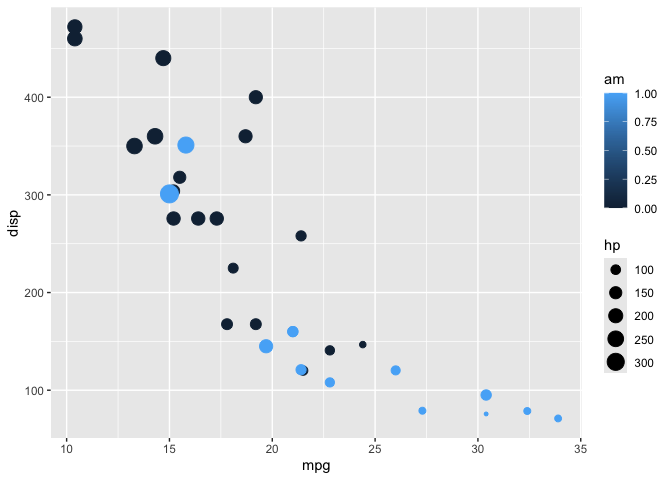
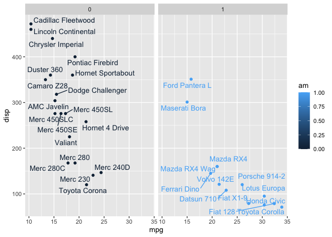

# Class 05
Abel

R has lot’s of ways to make figures and graphs in particlular. One that
come with R out the box is called **“bas” R** - the ‘plot()’ function.

``` r
plot(cars) 
```


------------------------------------------------------------------------

A very popular package in this area is callled **ggplot2**

Before I can use any add-on package like this I must install it with the
`install.packages("ggplot2")` command/function

Then to use hte package I need to load it with a ‘library(ggplot2)’
call.

``` r
library(ggplot2)
ggplot(cars) + 
  aes(x=speed, y=dist) + 
  geom_point()
```


For “simple” plots like this one base R code witll be much shorter than
ggplot code.

``` r
library(ggplot2)
ggplot(cars) + 
  aes(x=speed, y=dist) + 
  geom_point() +
  geom_smooth()
```

    `geom_smooth()` using method = 'loess' and formula = 'y ~ x'


Every ggplot has at least three layers

\-**data** (data.frame with the number or stuff you want to plot)
-**aes**tthetics (mapping of your data colums to your plot) -**geom**s
(there are tones of these, basics are `geom_point()`, `geom_line()`,
`geom_col()`)

``` r
head(mtcars)
```

                       mpg cyl disp  hp drat    wt  qsec vs am gear carb
    Mazda RX4         21.0   6  160 110 3.90 2.620 16.46  0  1    4    4
    Mazda RX4 Wag     21.0   6  160 110 3.90 2.875 17.02  0  1    4    4
    Datsun 710        22.8   4  108  93 3.85 2.320 18.61  1  1    4    1
    Hornet 4 Drive    21.4   6  258 110 3.08 3.215 19.44  1  0    3    1
    Hornet Sportabout 18.7   8  360 175 3.15 3.440 17.02  0  0    3    2
    Valiant           18.1   6  225 105 2.76 3.460 20.22  1  0    3    1

Make a ggplot of the `mtcars` data set using `mpp` vs `disp` and set the
size fo the points to the `hp` set the color to `am`

``` r
library(ggplot2)
ggplot(mtcars) + 
  aes(x=mpg, y= disp, size=hp, color= am) + 
  geom_point() 
```



``` r
library(ggrepel)

ggplot(mtcars) + 
  aes(x=mpg, y= disp, col=am, label=rownames(mtcars)) + 
  geom_point() +
  facet_wrap(~am) +
  geom_text_repel()
```



``` r
url <- "https://bioboot.github.io/bimm143_S20/class-material/up_down_expression.txt"
genes <- read.delim(url)
head(genes)
```

            Gene Condition1 Condition2      State
    1      A4GNT -3.6808610 -3.4401355 unchanging
    2       AAAS  4.5479580  4.3864126 unchanging
    3      AASDH  3.7190695  3.4787276 unchanging
    4       AATF  5.0784720  5.0151916 unchanging
    5       AATK  0.4711421  0.5598642 unchanging
    6 AB015752.4 -3.6808610 -3.5921390 unchanging

``` r
nrow(genes)
```

    [1] 5196

There are 5196 genese is this dataaset.

``` r
unique(genes$State)
```

    [1] "unchanging" "up"         "down"      

The `table()`function is super useful untility to tell me how many
entries of each type there are.

``` r
table(genes$State) / nrow(genes)
```


          down unchanging         up 
    0.01385681 0.96170131 0.02444188 

The functions `nrow()`, and `table()` are ones I want you to know

``` r
library(ggplot2)
ggplot(genes) +
aes(x=Condition1, y=Condition2) +
geom_point()
```


``` r
    ggplot(genes) + 
    aes(x=Condition1, y=Condition2, col=State) +
    geom_point()
```


``` r
ggplot(genes) + 
    aes(x=Condition1, y=Condition2, col=State) +
    geom_point() +
scale_colour_manual( values=c("blue","gray","red") )
```


``` r
ggplot(genes) + 
    aes(x=Condition1, y=Condition2, col=State) +
    geom_point() +
scale_colour_manual( values=c("blue","gray","red") ) +
labs(title = "Gene Expression Changes Upton Drug Treatment", x = "Control (no drug)", y= "Drug Treatment")
```


> key points

``` r
p <-ggplot(mtcars)+
  aes(mpg, disp) +
  geom_point()

ggsave("myplot.pdf")
```

    Saving 7 x 5 in image

``` r
p
```


